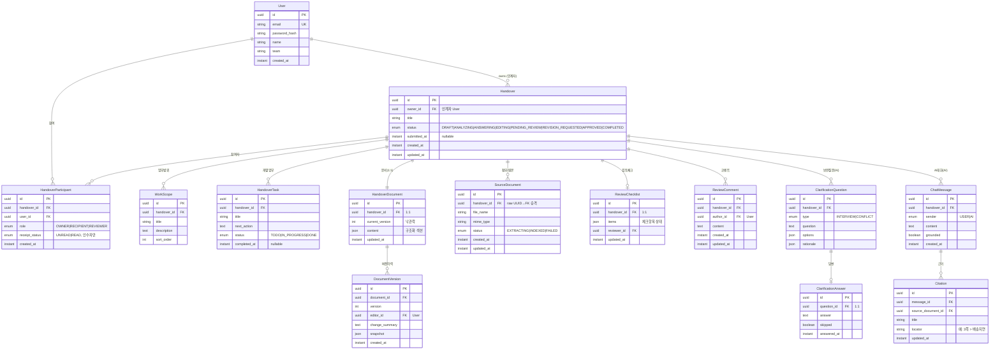

# Handover 도메인 ERD (초안)

> 기준: 분석 문서 + 기존 코드 컨벤션(`User`, `SourceDocument` 이미 존재).
> JPA `ddl-auto`로 엔티티 = 테이블이 되므로, 이 ERD는 그대로 엔티티 설계도이기도 하다.

## 설계 결정 (팀 합의 포인트)

1. **participant role = enum 컬럼** (별도 테이블 X). 한 handover에 인계자·인수자·관리자를 `HandoverParticipant` 한 테이블 + `role` enum으로 표현. 권한 검사는 (userId, handoverId, role)로 조회.
2. **WorkScope / HandoverTask = 별도 엔티티**. 문서가 `workScopes[]`, `tasks.{id}.nextAction` 같은 개별 편집을 요구하므로 문자열배열이 아니라 엔티티로.
3. **`SourceDocument` → `Handover` FK로 승격**. 지금은 `handoverId` raw UUID만 들고 있음. 진짜 `@ManyToOne`으로 묶어 정합성 확보 (AI 담당과 협의).

## 소유 경계

- 🟦 **handover 담당(나)**: Handover, HandoverParticipant, WorkScope, HandoverTask, HandoverDocument, DocumentVersion, ReviewChecklist, ReviewComment
- 🟨 **AI 담당**: SourceDocument(존재), ClarificationQuestion/Answer, ChatMessage/Citation, AnalysisJob
- 🟩 **auth 담당(존재)**: User

